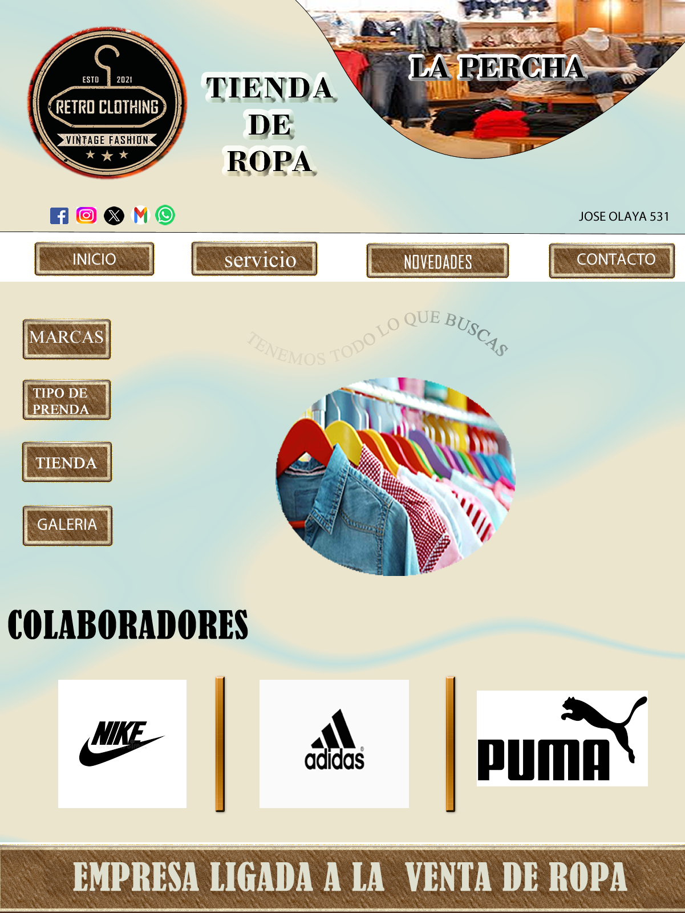

<!DOCTYPE html PUBLIC "-//W3C//DTD XHTML 1.0 Transitional//EN"
"http://www.w3.org/TR/xhtml1/DTD/xhtml1-transitional.dtd">
<!-- saved from url=(0014)about:internet -->
<html xmlns="http://www.w3.org/1999/xhtml">
<head>
<title>inicio</title>
<meta http-equiv="Content-Type" content="text/html; charset=utf-8" />
<!--Fireworks CS6 Dreamweaver CS6 target.  Created Thu Sep 19 07:30:34 GMT-0500 2024-->

</head>
<body bgcolor="#ffffff">

<map name="m_inicio" id="m_inicio">
<area shape="rect" coords="342,424,550,481" href="javascript:;" alt="" onmouseout="MM_menuStartTimeout(1000);"  onmouseover="MM_menuShowMenu('MMMenuContainer0919071921_0', 'MMMenu0919071921_0',349,483,'inicio');"  />
<area shape="rect" coords="58,424,272,482" href="marcas.html" alt="" />
</map>

	

		<a href="p.html" id="MMMenu0919071921_0_Item_0" class="MMMIFVStyleMMMenu0919071921_0" onmouseover="MM_menuOverMenuItem('MMMenu0919071921_0');">
			polos
		</a>
		<a href="c.html" id="MMMenu0919071921_0_Item_1" class="MMMIVStyleMMMenu0919071921_0" onmouseover="MM_menuOverMenuItem('MMMenu0919071921_0');">
			camisas
		</a>
		<a href="v.html" id="MMMenu0919071921_0_Item_2" class="MMMIVStyleMMMenu0919071921_0" onmouseover="MM_menuOverMenuItem('MMMenu0919071921_0');">
			vestidos
		</a>
	

</body>
</html>
